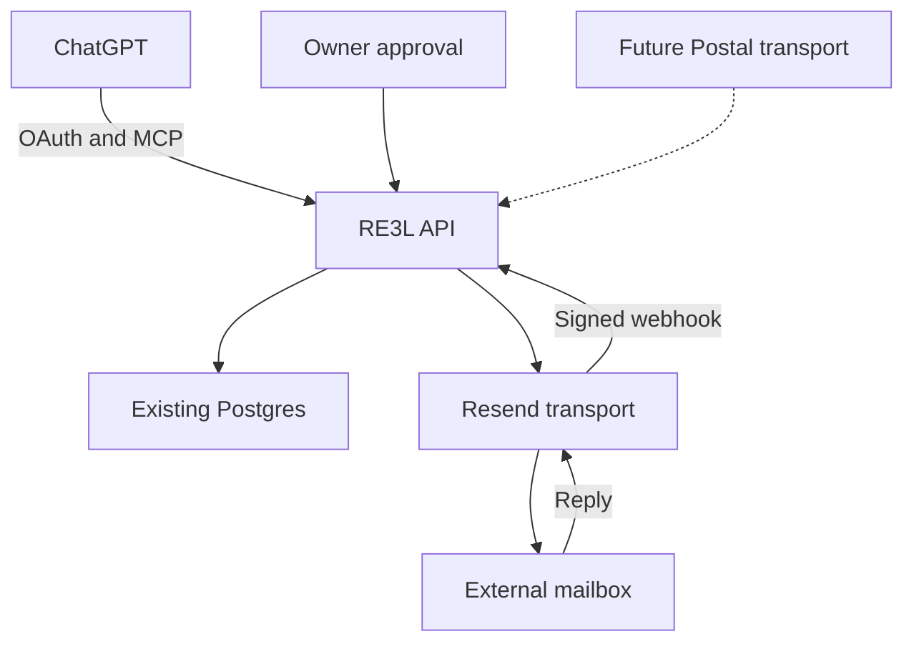

# RE3L Mail — Offgrid RC pilot

Self-hostable mailbox API and remote MCP service. The pilot reuses Resend for SMTP transport and the existing Floot Postgres/authentication deployment. It is not a newly implemented SMTP server, nor does it remove the current Resend dependency. Postal is the selected future self-hosted transport; that adapter is not deployed or verified yet.

## Audit and gap analysis — 10 October 2026

| Component | Finding | Action |
|---|---|---|
| HiHQHub/Offgridrc | Vite/React website, not an email service | Preserve root website files; add service in its own directory |
| Vercel website | offgridrc.com returns HTTP 200, Vercel server, Offgrid RC title | No website deployment changes; detailed project read blocked by connector scope |
| Porkbun | Existing repair workflow correctly cleans credentials and ensures sending MX/SPF | Reuse credentials; add only missing DMARC p=none record |
| Resend | Sending and receiving enabled; DKIM and all listed domain records verified | Reuse transport and existing domain |
| Floot prototype | Auth, Postgres, one small search endpoint; UI still prototype | Extend existing application and database, do not provision replacement resources |
| Inbound | No registered webhook at initial audit | Add signed webhook, replay protection and database persistence |
| Conversations | No reliable persistent thread model | Correlate using RFC Message-ID, In-Reply-To and References within mailbox/tenant |
| ChatGPT | Existing Resend connector, no RE3L connection | Add remote MCP and OAuth PKCE; account connection still requires the owner |

## Architecture



ChatGPT supplies orchestration when the user invokes it. The service makes no model calls and does not implement autonomous replies. Provider transport is separate from message storage and tool orchestration. Future Postal work must preserve the API and thread model.

## Foundation decision

- **Postal:** chosen for later transport replacement. MIT, real incoming routing, outbound SMTP/API, domains and server/user separation. Requires an always-on host, at least 4 GB RAM, inbound/outbound port 25, DNS/PTR, reputation management and operational maintenance. Not deployable as an SMTP daemon on Vercel.
- **useSend:** AGPL-3.0 and actively developed, but its documented sending foundation is Amazon SES. It is not a route to free, independent SMTP transport. Upstream's inbound checkbox is not a verified replacement for this pilot. If code is modified and served over a network, satisfy AGPL corresponding-source obligations.
- **Mailu/Stalwart:** broader mailbox/IMAP suites; additional deployment and operational scope for this single API-mailbox pilot. Revisit only if IMAP/mobile mail clients become requirements.
- **Pilot:** keep existing verified Resend rather than buy a server or migrate SMTP. No Postal/useSend code is vendored; their licences are not applied to independently authored RE3L code. The service directory is MIT licensed; dependencies retain their own licences.

Primary references: [Postal API](https://docs.postalserver.io/developer/api/), [Postal prerequisites](https://docs.postalserver.io/getting-started/prerequisites/), [Postal source and MIT licence](https://github.com/postalserver/postal), [useSend source and AGPL licence](https://github.com/usesend/useSend), [useSend SES transport](https://usesend.com/).

## Deployment

### Existing pilot

Application code is mirrored under `floot/` in this directory. The existing Floot project supplies its database, user sessions, JWT_SECRET and securely connected RESEND_API_KEY. Backend-only webhook signing secrets are AES-256-GCM encrypted in `re3l_settings`, using the existing JWT secret. Changing that encryption key requires decrypting/re-encrypting the stored webhook secret or replacing it. Do not rotate it blindly.

Endpoints:

- `POST /_api/re3l-api` — scoped API key, operation + arguments.
- `POST /_api/re3l-mcp` — remote MCP JSON-RPC, scoped key or OAuth token.
- `POST /_api/re3l-webhook` — Resend signed events, no browser authentication.
- `POST /_api/re3l-owner` — authenticated owner, same-origin CSRF gate, drafts/approval/key controls.
- `POST /_api/re3l-oauth-grant` — authenticated consent, exact client/redirect/audience and S256.
- `POST /_api/re3l-oauth-token` — code exchange and rotating refresh tokens.

The free Floot project does not provide the paid background task entitlement. Application send retries therefore remain persisted for manual retry/recovery there. Transport-level delivery retries are handled by Resend. The standalone worker below implements application queue retries; it has not been run against the live pilot. Do not claim a free background scheduler is deployed.

### Standalone Node service

1. Use an existing Node 22+ host and Postgres database. Do not purchase a host without approval.
2. `cd services/re3l-mail && npm ci`
3. Copy `.env.example` to an operator-owned secret file. Load it through a secrets manager or `node --env-file=.env`; never commit it.
4. Populate DATABASE_URL, existing RESEND_API_KEY, RESEND_WEBHOOK_SECRET and a strong separate RE3L_OWNER_APPROVAL_TOKEN. RE3L_ENCRYPTION_KEY is required only when using encrypted DB secrets instead of the webhook env var.
5. `node --env-file=.env bootstrap.mjs` installs additive tables and provisions the verified pilot mailbox once. Save the one-time mailbox API key securely. It does not issue domain-ownership verification or public signup for other domains.
6. `node --env-file=.env server.mjs`, reverse-proxied over HTTPS. Routes are `/api`, `/mcp`, `/webhook`, `/approve`, `/health`.
7. `node --env-file=.env worker.mjs` under a process supervisor for database-backed retries, limited to five attempts and less than 23 hours from draft creation. Older ambiguous sends move to manual_review; provider idempotency keys are never reused beyond their safety window.
8. Register the Resend webhook to the HTTPS `/webhook` route; copy the returned signing secret securely to the host configuration.
9. Back up Postgres and encryption keys; test restoration. Restrict DB access and preserve TLS.

The standalone server uses mailbox-scoped API keys and a separate owner approval credential. The shipped OAuth module is used by the Floot deployment; the standalone HTTP wrapper does not yet provide the OAuth consent UI. Connect it using a bearer-capable MCP client until that UI is ported. Dockerfile builds the API; run worker as a separate process/container. Host/database must be supplied by the operator, not provisioned by this repository.

## API usage

`Authorization: Bearer <mailbox key>` is required for API/MCP. Keys are stored hashed, tied to one tenant/mailbox, and can be revoked. OAuth tokens expire after one hour, have an exact resource audience, and use rotating 30-day refresh tokens.

```json
{"operation":"create_draft","arguments":{"to":["andrewgodliman@hotmail.com"],"subject":"Offgrid RC Email Test","text":"This is a test email sent using RE3L Mail and Resend."}}
```

A draft is immutable. Review its exact content in the owner interface, then approve. API-only deployments expose `/approve` with the separate `X-Owner-Approval` credential. The approval token is draft-bound, single-use, and expires in 10 minutes. It is not available to MCP without a separate owner action.

```json
{"operation":"send_email","arguments":{"draft_id":"<uuid>","approval_token":"<one-time owner token>"}}
```

Reply and forward operations create drafts and never send by themselves. Reply preserves References and In-Reply-To using the provider's final RFC Message-ID, not the provider API ID. Subject matches alone never join threads.

| Operation | Arguments | Behaviour |
|---|---|---|
| create_draft | to[], subject, text, optional attachments[] | Stores draft, returns exact review content |
| send_email | draft_id, approval_token | Consumes owner approval, claims queue row and sends idempotently |
| list_emails | optional limit 1–100 | Recent message summaries |
| read_email | id | Scoped message body/headers/attachment metadata; untrusted-content marker |
| search_emails | query, optional limit | Escaped text search in sender, subject and body |
| get_thread | thread_id | Oldest-first scoped conversation |
| reply_to_email | id, text | Threaded reply draft |
| forward_email | id, to[], optional text | Forward draft; attachments are not silently forwarded |
| sync_inbox | none | Manual recovery/backfill of up to 100 recent messages; exposes has_more |
| delivery_status | id | Provider event + final RFC Message-ID reconciliation |

Sending attachments accepts up to five filename/base64 content objects, each limited to approximately 1 MB decoded. Inbound attachment metadata is retained; durable file-copy, malware scanning and authenticated binary download are future work. The pilot does not fetch arbitrary URLs supplied by email content.

## ChatGPT connection

Published MCP URL: `https://re3l-mail-offgridrc.floot.app/_api/re3l-mcp` (verify the live deployment before using it).

Use the account's custom MCP/app setup and OAuth authentication. Discovery is at `/.well-known/oauth-protected-resource` and `/.well-known/oauth-authorization-server`. The OAuth client is the official ChatGPT CIMD document `https://chatgpt.com/oauth/client.json`, with S256 PKCE and the stable production redirect `https://chatgpt.com/connector_platform_oauth_redirect`. The owner signs into the existing RE3L account and explicitly grants read/write access; other registered users have no assigned pilot mailbox.

The endpoint implements initialize, tools/list, tools/call, ping and notifications over stateless HTTP JSON. GET returns 405; SSE is not used. Read-only keys are never offered write tools, and the executor independently enforces scopes. Sending is marked consequential/destructive. **The connector's installation and native ChatGPT consent UI must be tested on the owner's actual account before declaring the complete conversational pilot finished.** A headless MCP request from this work session proves the protocol endpoint, not the installed-app experience.

Example commands after connection: “Check my Offgrid RC inbox”, “Read the latest customer reply”, “Draft a reply confirming the order shipped”. Under the first-pilot safeguards, sends require exact-draft approval in RE3L's owner controls; they are not fully voice-only. No ChatGPT subscription is assumed to grant unrestricted API calls or continuous background execution.

Official integration reference: [OpenAI plugin authentication](https://developers.openai.com/plugins/build/auth).

## Security and deliverability

- [x] Verified existing sending/receiving domain, DKIM, sending SPF/MX and receiving MX.
- [x] Added DMARC `v=DMARC1; p=none` without changing web A/CNAME records. Monitoring only, not enforcement. Add reporting and evaluate alignment before quarantine/reject.
- [x] No open relay: sender fixed to the assigned verified mailbox; pilot recipient restricted to the authorised Hotmail address.
- [x] Tenant/mailbox predicates on reads, searches, drafts, approvals and dispatch; composite mailbox/tenant foreign keys.
- [x] Signed webhook raw-body verification, five-minute timestamp window, transaction-backed replay protection.
- [x] Hash-only API keys, OAuth PKCE, one-time code exchange, audience/expiry checks and refresh rotation.
- [x] No autonomous interpretation or execution of inbound instructions; email bodies explicitly marked untrusted.
- [x] Exact immutable draft approval, header-injection checks, request/attachment limits and audit trail.
- [x] API-key rate limit 30/minute and pilot send cap 25/day; not a commercial anti-abuse system.
- [x] Bounce/complaint suppressions and provider idempotency keys; conservative retry deadline.
- [ ] Server-level abuse limits/WAF, signup/domain-ownership workflow, storage quotas, formal cross-tenant security review.
- [ ] Malware scan, durable attachment objects, comprehensive HTML/plaintext handling.
- [ ] Commercial key rotation, privacy policy, data processor contracts, retention automation, export/deletion workflows.
- [ ] Backup restore, failover, dedicated SMTP reputation/warmup and enforced DMARC for Postal.

Messages are kept until the operator deletes them; no silent retention timer is enabled during the pilot. Commercial recommendation: configurable message retention, short-lived webhook/audit metadata, legal-hold exceptions, verifiable deletion from object storage and backups. Do not describe configurable GDPR retention as implemented today.

## Verified pilot evidence

10 October 2026, UTC:

1. RE3L created/approved/stored/sent message `12744ec1-ad77-4469-875e-82024cb5965a`; Resend ID `01a12400-1323-7b5c-9069-9613c378fe5a`.
2. Resend status delivered; actual Hotmail inbox receipt 04:09:09.
3. External reply stored at 04:09:49; the user's separate “Looks good” reply was also received and read.
4. MCP tools/call → get_thread returned outgoing and incoming messages in thread `e7599598-3c9c-481e-8b31-46e8d8f072bd`.
5. RE3L replied as message `aef87b6a-bf85-467e-a8ee-c832869ecd50`; Resend ID `01a12401-c2fc-71c5-b540-5c75011b89c8`.
6. Final reply delivered and actually received in Hotmail at 04:11:00.
7. Signed inbound webhook automatically stored another authorised external reply at 04:16:26 in the same thread, without sync.
8. Live database checks denied cross-tenant read, read-only write and invalid approval. Local tests cover header injection, webhook tampering/expiry, RFC references, permissions, OAuth constraints and authenticated secret encryption.

These verify email transport, database persistence, RFC correlation and a headless MCP call. Native ChatGPT app installation, its consent UX and a tool invocation through that installed app remain separate acceptance checks. No claim of Postal deployment or production-scale validation is made.

## Costs

No paid account, plan upgrade, infrastructure purchase or OpenAI API integration was activated. Two outgoing test emails and their incoming replies consume the existing Resend quota. Work-session execution credits and existing Floot hosting usage still apply; they are not free infrastructure.

Assumptions for estimates: each active user sends 100 and receives 100 messages/month; bodies average 50 KB; 90-day retention; attachments, staff, taxes, domain registration and premium AI excluded. Larger attachments or heavy inbox searches can change costs materially. USD prices are not converted to GBP.

| Scale | Messages/month (send + receive) | Resend quota/transport illustration | Independent Postal hosting + DB/backup planning range |
|---|---:|---:|---:|
| One pilot user | 200 | $0 subscription within existing free limits | Do not provision: reuse existing Floot; metered hosting may be a few dollars/month |
| 100 users | 20,000 | Pro $20/month before extra domains | $20–60/month |
| 1,000 users | 200,000 | Pro arithmetic $155/month before domains; evaluate Scale instead | $80–250/month |
| 10,000 users | 2,000,000 | Pro arithmetic $1,775/month before domains; Enterprise/Scale quote required | $400–1,500/month |

Resend pricing checked 10 October 2026: Free 3,000 combined sending/receiving messages/month, 100/day, three domains. Pro $20/month includes 50,000 messages; extra messages $0.90/1,000. Add-on $20/month per additional 100 domains on eligible plans. Thus 100 separate customer domains is not the same as 100 users on one domain. These examples are arithmetic, not purchase recommendations or approved spending.

Alternative useSend+SES transport arithmetic: base à-la-carte SES $0.10/1,000 sent plus $0.10/1,000 received, plus incoming chunks, storage, compute and attachment transfer. At the stated volumes base transport is roughly $2 / $20 / $200 for 100 / 1,000 / 10,000 users. Account limits, SES production access, supporting services and licences still apply. This option has not been activated.

Postal software is free/MIT; its cash ranges above are engineering planning estimates, not provider quotes or guaranteed deliverability. Running it at home still incurs power, bandwidth and operational cost, and requires routable SMTP/PTR support. API-only Vercel functions cannot host Postal's SMTP daemon. A ChatGPT subscription does not fund the host or email transport.

Sources: [Resend pricing](https://resend.com/pricing), [SES pricing](https://aws.amazon.com/ses/pricing/), [Postal prerequisites](https://docs.postalserver.io/getting-started/prerequisites/).

## Roadmap, gated by the single-mailbox pilot

1. Finish the owner-account ChatGPT connection and publish/check persistent endpoints; retain approval safeguards.
2. Complete attachment downloads/storage/scanning, reliable HTML text fallback, pagination and recovery/retry UI.
3. Implement and test Postal send/inbound/event adapters on an approved existing or funded host; move MX only after parallel acceptance tests and a rollback plan.
4. Add domain-ownership verification, mailbox roles, tenant invitations, scoped sending limits and abuse review.
5. Add automated retention/export/deletion, backups/restores, monitoring/alerting and support procedures.
6. Only then consider commercial signup/billing, higher volume delivery and optional separately funded AI automation.
